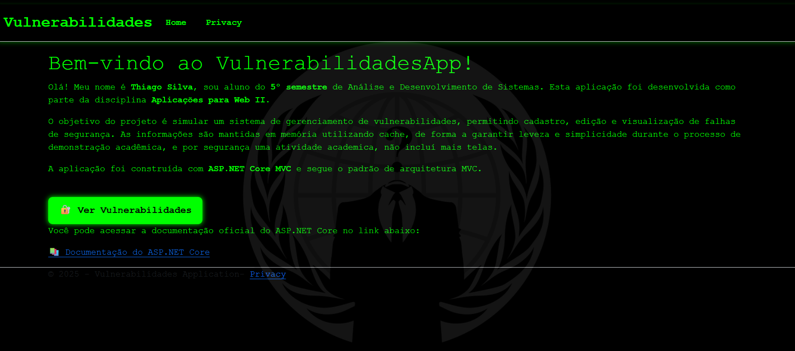
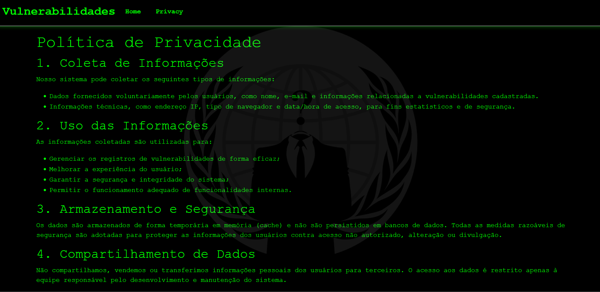
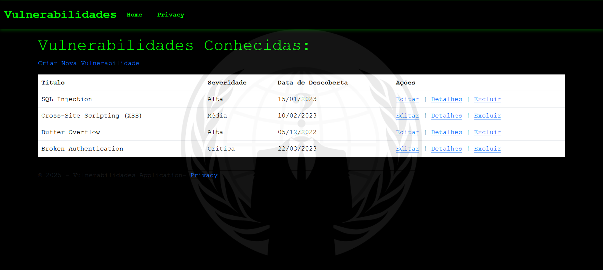

# VulnerabilidadesApp

o App de Vulnerabilidades é uma aplicação web para a gestão e listagem de vulnerabilidades com uma temática hacker. A aplicação permite visualizar e incluir informações sobre vulnerabilidades descobertas reúnidas em uma interface amigável e organizada.
Trabalho desenvolvido pelo Aluno Thiago Silva Melo de Oliveira, do 5º semestre de TADS, UNIDESC.

## Capturas de Tela

### Página Home


### Página Privacy


### Página Vulnerabilidades


## Como executar

1. Certifique-se de ter o .NET SDK instalado.
2. Navegue até a pasta do projeto via terminal.
3. Execute o comando: ``` dotnet run```
